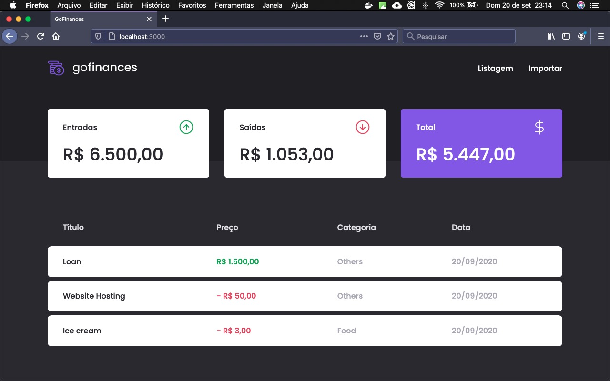
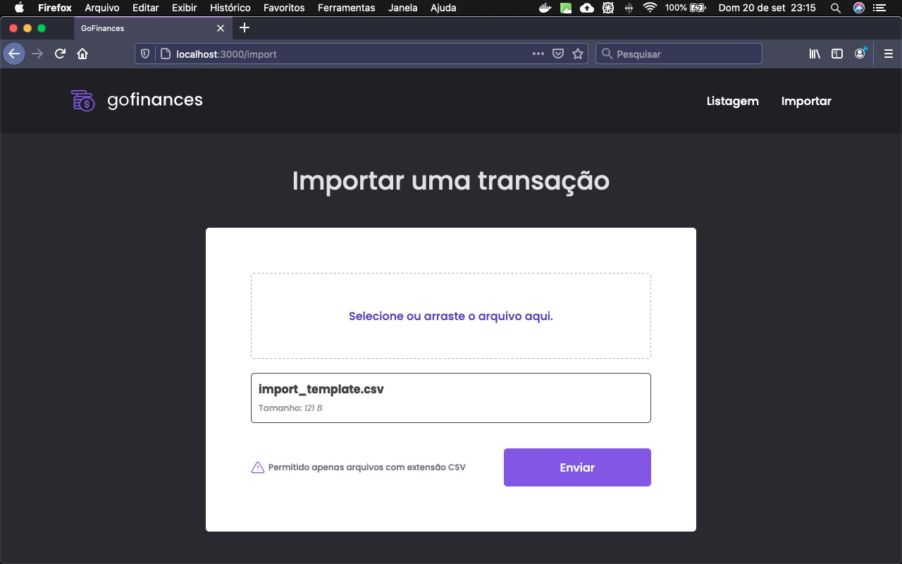

    

 

 

<a href="https://gracious-fermat-aa39e6.netlify.app/" target="_blank">Deployed</a>

---

## 💻 Project
- Project developed during <strong> Bootcamp GoStack #13 </strong> which has the educational objective.
<strong> GoFinances </strong> is an application where the user can control his finances.
---

## :rocket: Technologies

- [x] React.js
- [x] TypeScript
- [x] Styled Components
- [x] Polished
- [x] Axios
- [x] Filesize
- [x] History
- [x] React Dropzone

---

## :arrow_forward:  Usage

1. Run `yarn install` or `npm install`. 
2. Run `yarn start` and access `http://localhost:3000`. 

---

## 🛠 Contributing

- Please read [CONTRIBUTING.md](CONTRIBUTING.md) for details on our code of conduct, and the process for submitting pull requests.

---

## 🧾 Licence

- Please read [LICENSE](LICENSE.md) for details.

---

Made with 💜 &nbsp; by [Paulo Vieira](https://www.linkedin.com/in/paulorcvieira/)
